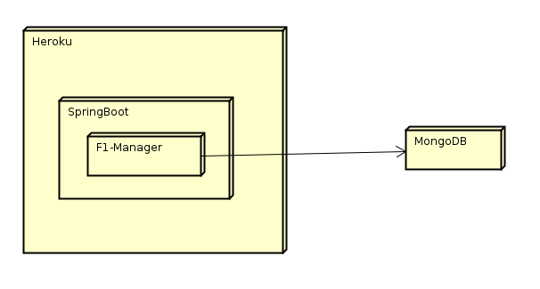

# F1-Manager

## Arquitectura de Software 2018-2

### Heroku link:
https://f1-manager.herokuapp.com/

### Members
- Daniela González
- Mateo Guzmán
- Sebastián Reyes
- Diana Sánchez

## Architecture

La arquitectura esta compuesta por un cliente pesado en Javascript, un controlador Spring para aceptar multiples peticiones HTTP realizadas desde un cliente WEB, el controlador tiene inyectado un servicio que se encarga de realizar las operaciones de la aplicación y las transacciones en la base de datos (MongoDB). La aplicación garantiza autenticación y autorización mediante token (JWT).

- Component architecture:

- Deployment architecture:

